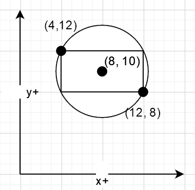

## Overview

This homework is an extension of your lab work in writing and testing functions to gain greater familiarity in problem-solving from a computational perspective. 

## Course Learning Objects

### Direct
- ✍️ Assess the quality of Python code in terms of readability, maintainability, and adherence to standard conventions.
- 🧪 Design and implement a set of unit tests to validate program functionality, including edge cases.

### Indirect
- 💻 Describe the basic syntax and semantics of a modern programming language, including variables, data types, expressions, and statements.
- 🌐 Utilize a modern, networked development environment including usage of industry-standard IDE and version control platforms.
- 🧠 Analyze the execution of a non-trivial computer program using a mental model of computation.

## Instructions

For each of the following eight (8) tasks, you are expected to add (at least) one function to the `function_definitions.py` file and at least two (2) test cases to the `function_tests.py` file.

You are expected to follow the *design recipe* outlined below for each function definition:
- Briefly state the purpose of the function including its input and output. 
- Identify the representation of the data to be used in the computation. 
- Name and template the function.
- Do computation **by hand** and write tests.
- Complete the function implementation.

Your functions must follow the style guidelines outlined in the rubric for full credit.

> [!TIP]
> 
> You are allowed, and *encouraged*, to create "helper/utility" functions to simplify implementation of your functions.

### Task 1
Define a function named `vowel_count`.
The function must take one parameter of type `str`.
The function must count and return the number of vowels that exist in the input string.
You must consider only the standard five English vowels.

### Task 2
Define a function named `short_lists`.
The function must take one parameter of type `list[list[int]]`.
The function must return a *new* list containing only elements from the input list that are of length 2.
The output list should be ordered corresponding to the input list.

### Task 3
Define a function named `ascending_pairs`.
The function must take one parameter of type `list[list[int]]`.
The function must return a *new* list containing the nested lists from the input list, except that nested lists from the input list of length 2 are sorted will have their elements sorted in ascending order. 
The input list should not be modified.
The output list should be ordered corresponding to the input list.

### Task 4
Define a function named `add_prices`.
The function must accept two parameters of type `Price`.
The function must return a new `Price` object initialized to contain the sum of the two prices such that the number of cents does not exceed 99.

> [!TIP]
> 
> There are multiple valid approaches to the implementation of this function including with or without the use of a conditional statement.

### Task 5
Define a function named `rectangle_perimeter`.
The function must accept one parameter of type `Rectangle`.
The function must return the perimeter of the rectangle with the assumption that the rectangle is properly axis-aligned.
That is: (1) the top-left corner is above and to the left of the bottom-right corner and that (2) the horizontal and vertical sides are parallel with the x- and y-axes, respectively.

### Task 6
Define a function named `books_by_author`.
The function must accept two parameters, (1) an author name as a `str` and (2) a `list[Book]`.
The function must return *new* list of all books from the input list written by the author specified by the first parameter.
The input list should not be modified.
The output list should be ordered corresponding to the input list.

> [!NOTE]
> 
> How might a similar function apply to real-world application like Apple Music or Spotify?

### Task 7
Define a function named `circle_bound`.
The function must accept a parameter of type `Rectangle`.
The function must return a new `Circle` instance that represents a "bounding circle" for the rectangle.
That is, the circle should be the smallest circle that encloses the rectangle and is centered within it.

> [!TIP]
> 
> The circle will have a radius equal to the distance from the center of the rectangle to one of its corner points.

> [!NOTE]
> 
> Such bounding circles (or bounding shapes in general, and typically in three-dimensions) are used to reduce the computational cost required to check for potential collisions in 3d environments including use in robot route planning and navigation for automated vehicles.

#### Example Diagram

### Task 8
Define a function named `below_pay_average`.
The function must accept a parameter of type `list[Employee]`.
The function must return a new list containing the ***names*** (`list[str]`) of employees being paid less than the average pay of all employees in the list.
The function will require computing the average employee pay rate.
The function must work properly when the input list is empty.
The output list should be ordered corresponding to the input list.

> [!NOTE]
> 
> This function might be used to identify those employees whose pay may be artificially lower than their coworkers.