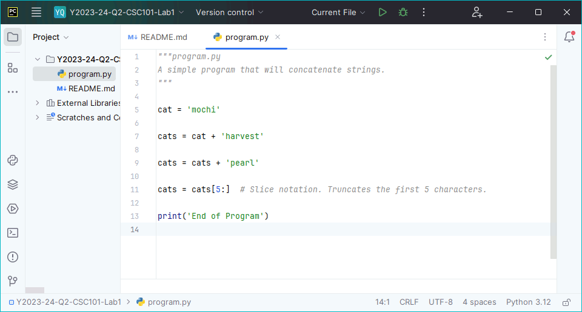
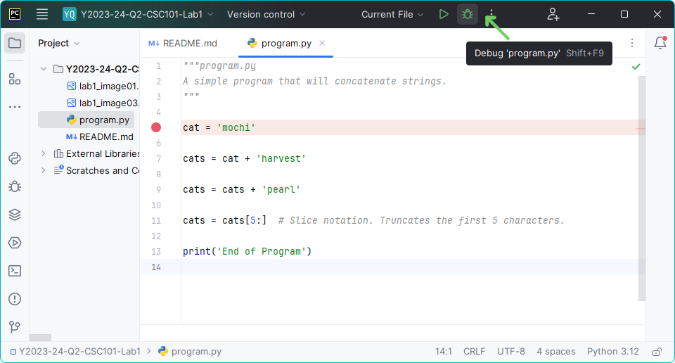
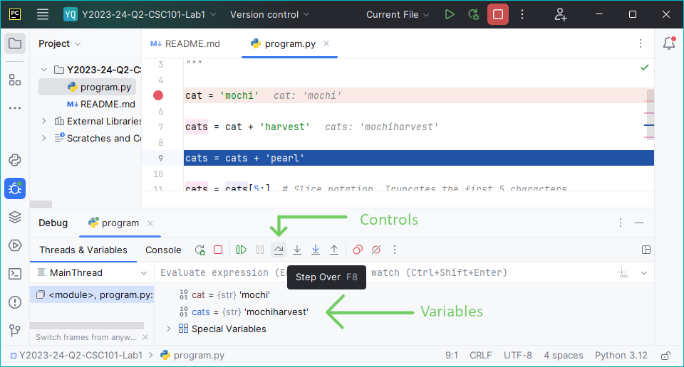

[](https://classroom.github.com/a/RkrdRxqZ)
# Lab 1

## Course Information
- **Course:** CSC 101
- **Instructor:** Professor Vanessa Rivera
- **Term:** 2023-24 Winter Quarter

## Overview
In this first lab assignment, you will practice writing Python expressions and eventually create a program trace table.
Expressions in Python can be thought of as verbs in a written language: they are fragments that specify some action or calculation (i.e., processing) that are typically combined with other parts of the language.
A trace table is a memory history of a program.
Programmers can use trace tables to help debug, or fix, complex programs as they allow you to track down otherwise invisible errors that might exist.

Lastly, you will perform your first lab demonstration.
Being able to communicate the behavior and reasoning behind code is a necessary skill for a competent programmer.
Proper human-to-human articulation of programming ideas is invaluable as you inevitably will seek to learn better solutions or work with others on a larger project, for example, as an employee.

## Learning Objectives
In completing this assessment, you will be able to:
- Use Python's interactive mode to evaluate expressions. (💻)
- Determine a value's data type using Python's `type()` function. (💻)
- Analyze a simple program using PyCharm's debugger. (🧠, 🌐)

## Instructions
### Task 1: Use Python's Interactive Mode
**🎯 Task Goal:** Use PyCharm's Python Console window to evaluate expressions.

**Python's Interactive Mode:** Python is a popular, high-level programming language known for its readability and versatility.
The Python interpreter is a program that reads and executes the code you write.
By installing it, you gain the power to write and run Python scripts.

1. **Access PyCharm's Python Console Window:** On the left side of the PyCharm window, press the "Python Console" button to open up Python's interactive mode.
   - You may also directly run the Python application installed on your system instead.
2. **Evaluate the following Expressions:** For each expression below, type the expressions into the console then evaluate it by pressing the "Enter" key.
   - `3 + 4`
   - `3.0 + 4.0`
   - `3 + 4.0`
   - `'3' + '4.0'`
   - `14 / 3`
   - `14 // 3`
   - `14 // 3.0`
   - `14 % 3`
   - `4 * 2 + 27 // 3 + 4`
   - `4 * (2 + 27) // 3 + 4`
   - `'🐈' * 3`
     - **Tip:** You can copy and paste the emoji into the terminal
   - ```
     x = 3
     y = 4
     x ** y
     ```
3. **Write Down Each Output:** For each expression above, record your answers as part of your Canvas submission.

### Task 2: Evaluated Value Types
**🎯 Task Goal:** Use the `type()` function to determine evaluated expression data types.

**The "type()" Function:** In Python, you can determine a value's data type by using the `type()` function.
For example, the statement:
```python
print(type(1.0))
```
will display the text:
```
<class 'float'>
```
indicating that the value `1.0` is of type `float`.

1. **Access PyCharm's Python Console Window:** On the left side of the PyCharm window, press the "Python Console" button to open up Python's interactive mode.
   - You may also directly run the Python application installed on your system instead.
2. **Evaluate Expressions Types:** For each expression from Task 1, rewrite the expression using the `type()` function.
   - **Example:** For the first expression, instead of entering `3 + 4` you would enter `type(3 + 4)`.
   - **Last Expression:** For the final expression, only use the `type()` function with the last statement, not the assignment statements containing the assignment (`=`) operators.
3. **Write Down Each Output:** For each expression, record your answers as part of your Canvas submission.

### Task 3: Evaluate the Execution of a Program
**🎯 Task Goal:** Use the PyCharm debugger to step through and trace a program.

**The PyCharm Debugger:** PyCharm includes a **debugger** that allows you to execute your code step-by-step, inspect variables, and understand the flow of your program.
Learning to use the debugger effectively will enhance your problem-solving skills and help you write more robust code.

1. **Open `program.py` in PyCharm:** Ensure your script is ready and open.
2. **Copy the Program:** Within the editor, copy the following program into the `program.py` file:
   ```python
   cat = 'mochi'
   
   cats = cat + 'harvest'
   
   cats = cats + 'pearl'
   
   cats = cats[5:]  # Slice notation. Truncates the first 5 characters.
   
   print('End of Program')
   ```
   - **Muscle Memory:** Though you can copy the code below and paste it into the IDE, I recommend that you type the code yourself (now and for the next few weeks) to build muscle memory.
     This may seem pointless, but the more that you use the syntax, the more familiar it will become.
     This will make it easier to recall syntax when, eventually, writing code on quizzes (and job interviews).
3. **Set a Breakpoint on the First Assignment Statement:** Click on the left margin next to the line ```cat = 'mochi'``` to set a breakpoint.
   This tells the debugger to pause execution at this line.
   
4. **Start the Debugger:** Initiate the debugger by clicking the "Debug" button (usually depicted with a green bug icon).
   
5. **Step Through the Code:** Once the debugger pauses at the first breakpoint, use the “Step Over” feature to execute the code line-by-line.
   This allows you to observe the assignment of the `cat` and `cats` variables as the program progresses.
6. **Inspect Variable Values:** As you step through, take the opportunity to examine the values of each variable in the Debug tool window which opens at the bottom of the main window.
   This window displays the values currently bound to each variable in the program.
   
7. **Create a Trace Table:** Create a trace table for the program as part of your Canvas submission.
   An empty table is provided below that you may copy and paste into the submission box.
   
   | Line | cat | cats |
   |:----:|:---:|:----:|
   |      |     |      |
   |      |     |      |
   |      |     |      |
   |      |     |      |
   |      |     |      |
8. **Commit Your Changes:** In PyCharm, right-click on the `program.py` file in the Project tool window and select `Git` > `Commit File`.
9. **Push to GitHub:** After committing, click the `Git` option in the top menu and select `Push`.

### Task 5: Demonstration to an Instructor

**🎯 Task Goal:** Demonstrate your code to me or an assistant instructor.

**Realtime Demonstrations:** In this course, we emphasize not only the submission of assignments but also the demonstration of your coding process.
These in-person demonstrations help reinforce your understanding, provide an opportunity for immediate feedback, and foster a deeper connection with the course material.
Demonstrating your work allows you to articulate your thought process, a skill far more important than simply understanding syntax.

**Meeting with an Instructor:** Come see me during lab when you are ready to demonstrate your code.
You may also demonstrate code to an instructional student assistant (ISA) or during my office hours.
I will have you walk me through your code and then assign you a grade.
Be prepared to:
- Show your answers to Tasks 1 and 2.
- Execute your `program.py` program using the debugger.
- Step through the code, starting from the first breakpoint.
- Respond to any questions about your program and the changes you implemented.

**Using the Demonstration Success Guidelines:** Refer to the guidelines provided toward the end of this document to prepare for your demonstration.
They are designed to help you focus on key aspects of your assignment and ensure you are ready to showcase your work effectively.

**Completion:** Your assignment is considered complete once you have effectively demonstrated your understanding and execution of the `program.py` program using the debugger.
This practical demonstration is a crucial part of your learning process, confirming your comprehension of the programming concepts and tools involved.

## Resources
- [JetBrains.com: Debug your first Python Project](https://www.jetbrains.com/help/pycharm/debugging-your-first-python-application.html): A guide that demonstrates how to use the PyCharm debugger. Only the "Finding the origin of the problem" section is relevant.

## Academic Integrity
> [!Warning]
> 
> Submitting this assignment confirms that you did not use solutions or code from external, AI-generated, or peer sources.
>
> You also agree to have your code checked by standard plagiarism detection software.
>
> Violation will result in a grade of zero, a report to the University, and further potential action.
>
> Please contact me or see our course syllabus for clarification or further details.

## Demonstration Success Guidelines
Be able to:
* Recite answers for tasks 1 and 2.
* Run the PyCharm debugger with a breakpoint.
* Create a trace table for `program.py`.
* Show your GitHub.com repository containing your pushed code.
* Show your Canvas submission.

*Note: Your critical-thinking skills and ability to articulate your understanding will be assessed. You should be able to answer questions in your own words, without merely reading lines of code or comments.*

## Success Checklist
- [ ] Evaluated all 12 Task 1 expressions.
- [ ] Evaluated all 12 Task 2 expressions.
- [ ] Created a trace table for `program.py`.
- [ ] Submitted expression evaluations and the trace table to Canvas.
- [ ] Committed and Pushed `program.py` to GitHub.
- [ ] Submitted screenshot evidence of your GitHub submission to Canvas.
  - [ ] The repository name is included.
  - [ ] The green checkmark is included.
- [ ] Demonstrated your lab to an instructor.